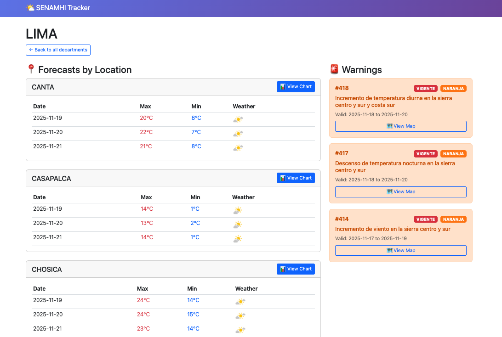
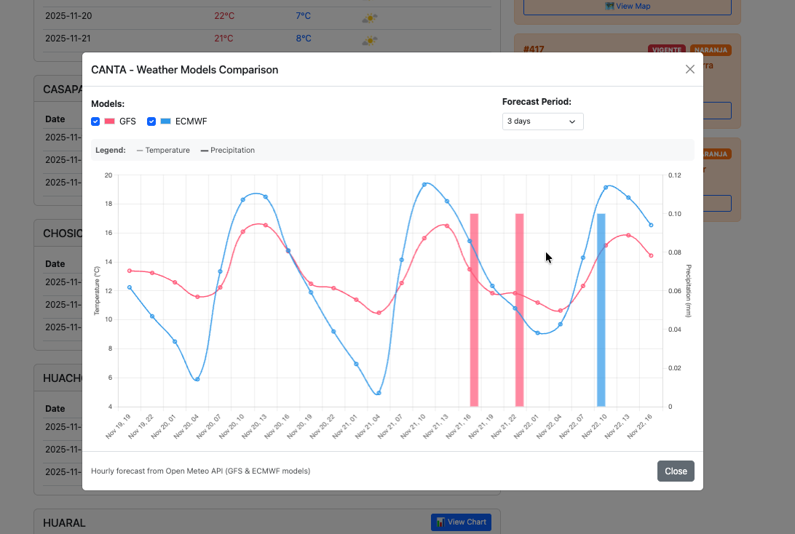
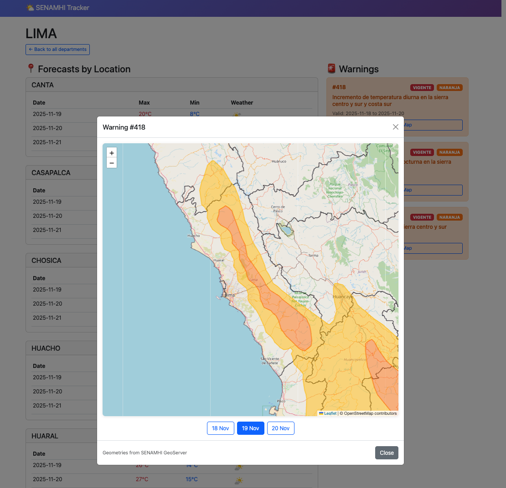

# 🌤️ SENAMHI Tracker

> Centralized weather monitoring system for Peru - consolidating SENAMHI forecasts, warnings, and geospatial data in one place with multi-model comparison.

[](https://www.python.org/downloads/)
[](LICENSE)

## 📖 Overview

**The Problem:** SENAMHI's website scatters weather information across multiple pages and formats - forecasts are on one page, warnings require clicking through each department, and geospatial data requires GIS software.

**The Solution:** SENAMHI Tracker consolidates all meteorological data into a single, searchable database with:
- **Unified access** to forecasts and warnings
- **Interactive maps** showing warning coverage areas
- **Multi-model comparison** (SENAMHI vs GFS vs ECMWF) to validate forecasts
- **Historical tracking** to monitor forecast accuracy over time
- **Automated monitoring** with scheduled updates

Perfect for researchers, meteorologists, emergency responders, and anyone tracking Peru's weather patterns.

## 🎯 Key Features

- 🌍 **Consolidated Data** - All 24 departments in one database
- 🚨 **Real-time Warnings** - Track active meteorological alerts
- 🗺️ **Interactive Maps** - Visualize warning areas with PostGIS
- 📊 **Model Comparison** - Compare SENAMHI with global models (GFS, ECMWF)
- ⏰ **Automated Updates** - Scheduled scraping every 6-24 hours
- 🐳 **Easy Deployment** - Docker support with SQLite or PostgreSQL

## 🏗️ Architecture
```
┌─────────────────────────────────────────────────────────────────┐
│                        SENAMHI Tracker                          │
└─────────────────────────────────────────────────────────────────┘
                              │
                    ┌─────────┴─────────┐
                    │                   │
            ┌───────▼────────┐  ┌──────▼──────┐
            │   Schedulers   │  │   CLI/Web   │
            │   (Background) │  │   (Manual)  │
            └───────┬────────┘  └───────┬─────┘
                    │                   │
        ┌───────────┼───────────────────┼──────────┐
        │           │                   │          │
   ┌────▼────┐ ┌───▼─────┐ ┌──────────▼─────┐ ┌──▼────────┐
   │Forecasts│ │Warnings │ │ Shapefiles     │ │Open-Meteo │
   │Scraper  │ │Scraper  │ │ Downloader     │ │API Client │
   └────┬────┘ └───┬─────┘ └─────────┬──────┘ └───┬───────┘
        │          │                 │            │
        │      ┌───▼─────────────────▼────────────▼────┐
        │      │                                       │
        └─────►│  Database (SQLite / PostgreSQL)       │
               │  - Forecasts                          │
               │  - Warnings                           │
               │  - Geometries (PostGIS)               │
               │  - Locations + Coordinates            │
               └───────────────┬───────────────────────┘
                               │
                    ┌──────────┴──────────┐
                    │                     │
              ┌─────▼──────┐      ┌──────▼──────┐
              │ Web UI     │      │  REST API   │
              │ (Flask)    │      │  (GeoJSON)  │
              └────────────┘      └─────────────┘
```

**Data Flow:**
1. **Scrapers** fetch data from SENAMHI website (forecasts + warnings)
2. **Shapefile Downloader** gets geospatial data from SENAMHI GeoServer
3. **Database** stores everything (SQLite for simple, PostgreSQL+PostGIS for maps)
4. **Open-Meteo** provides alternative model forecasts (GFS, ECMWF)
5. **Web UI** displays unified view with interactive maps and charts
6. **REST API** serves GeoJSON for mapping applications

## 🚀 Quick Start

### Installation
```bash
# Clone repository
git clone https://github.com/rosepb28/senamhi-tracker.git
cd senamhi-tracker

# Install dependencies
poetry install

# Setup database
poetry run alembic upgrade head

# Configure
cp .env.example .env
```

### Basic Usage
```bash
# Scrape forecasts and warnings
poetry run senamhi scrape

# View active warnings
poetry run senamhi warnings active

# Start web dashboard
poetry run senamhi web
# Visit: http://localhost:5001
```

### Docker (Recommended)
```bash
# Simple SQLite deployment
docker compose up -d

# Full PostgreSQL + PostGIS (with maps)
docker compose -f docker-compose.postgres.yml up -d
```

## 📚 Documentation

Comprehensive guides available in [`docs/`](docs/):

- **[Installation Guide](docs/installation.md)** - Local and Docker setup
- **[Configuration](docs/configuration.md)** - Environment variables
- **[CLI Usage](docs/usage/cli.md)** - Command reference
- **[Web Dashboard](docs/usage/web.md)** - Web interface guide
- **[Geospatial Features](docs/features/geospatial.md)** - PostGIS and maps
- **[Development](docs/development/setup.md)** - Contributing guide
- **[Troubleshooting](docs/troubleshooting.md)** - Common issues

## 💡 Use Cases

### Emergency Response
Monitor active warnings and view affected areas on interactive maps to coordinate response efforts.

### Research & Analysis
Track forecast accuracy over time, compare models, and analyze meteorological patterns.

### Personal Weather Monitoring
Get consolidated weather information for your region without navigating multiple websites.

### Application Integration
Use REST API to integrate Peru weather data into your applications.

## 🛠️ Tech Stack

- **Python 3.12+** - Core language
- **Poetry** - Dependency management
- **SQLAlchemy** - Database ORM
- **PostgreSQL + PostGIS** - Geospatial database (optional)
- **Flask** - Web framework
- **Leaflet.js** - Interactive maps
- **Chart.js** - Data visualization
- **Docker** - Containerization
- **Beautiful Soup** - Web scraping

## 📊 Project Status

**Current Version:** 0.1.0

**Features:**
- ✅ Forecast scraping (all 24 departments)
- ✅ Warning alerts tracking
- ✅ Geospatial visualization (PostGIS)
- ✅ Multi-model comparison (Open-Meteo)
- ✅ Automated scheduling
- ✅ Web dashboard with interactive maps
- ✅ REST API
- ✅ Docker support

**Roadmap:**
- 📝 Historical forecast accuracy analysis
- 📝 Email/SMS notifications for warnings

## 📸 Screenshots

### Dashboard Overview

*Consolidated view of forecasts and active warnings for Lima department*

### Multi-Model Comparison

*Compare SENAMHI forecasts with GFS and ECMWF models*

### Interactive Warning Maps

*Geospatial visualization of warning areas with day-by-day progression*

## 🤝 Contributing

Contributions are welcome! See [Development Guide](docs/development/setup.md).
```bash
# Fork, clone, and install
git clone your-fork
poetry install

# Create feature branch
git checkout -b feat/amazing-feature

# Make changes and test
poetry run pytest -v

# Submit pull request
```

## 📄 License

MIT License - see [LICENSE](LICENSE) file.

## 🙏 Acknowledgments

- **Data Sources:**
  - [SENAMHI](https://www.senamhi.gob.pe/) - Official Peru weather service
  - [SENAMHI GeoServer](https://idesep.senamhi.gob.pe/geoserver) - Geospatial data
  - [INEI](https://www.inei.gob.pe/) - Peru administrative boundaries
  - [Open-Meteo](https://open-meteo.com/) - Global weather models

- **Technologies:**
  - Built with Python, Flask, PostgreSQL, PostGIS, SQLAlchemy, Leaflet.js, and Chart.js

## ⚠️ Disclaimer

This project is for educational and research purposes. Please respect SENAMHI's terms of service and rate limits. Not affiliated with SENAMHI.
