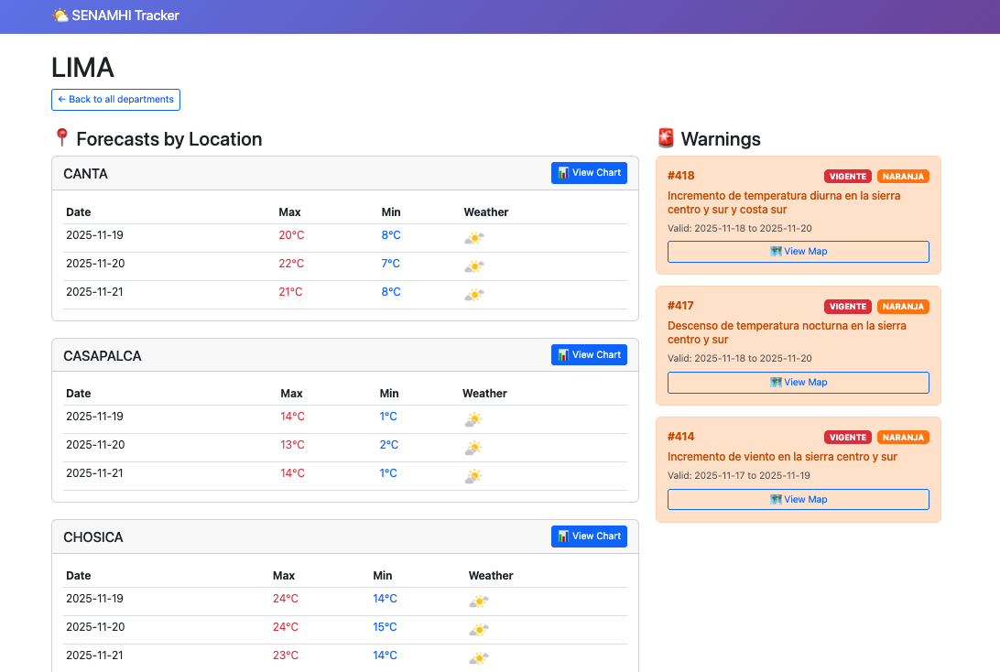
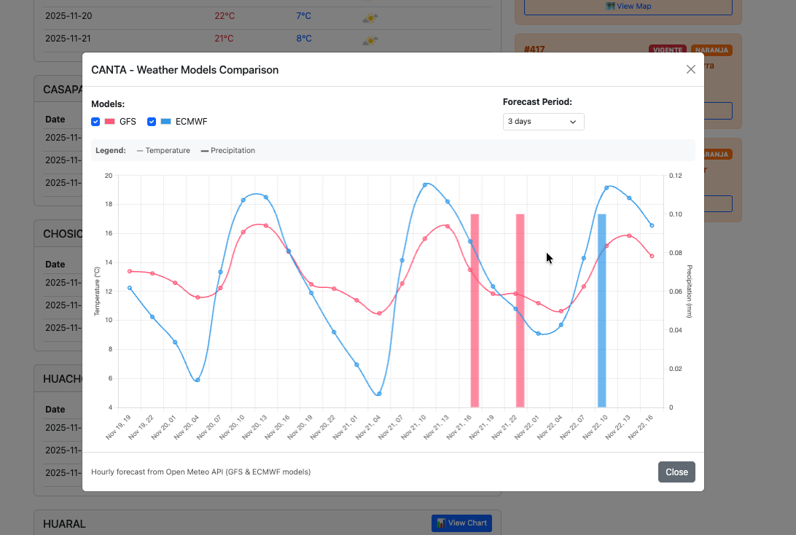
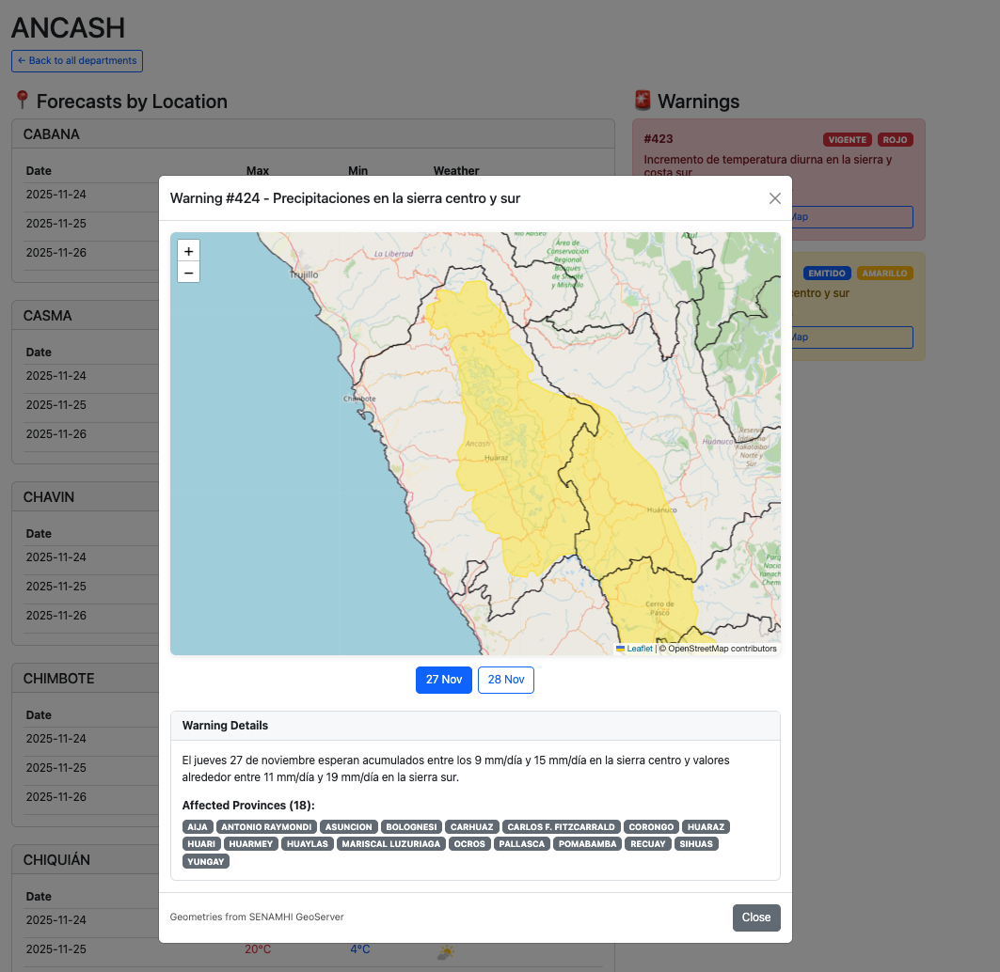

# 🌤️ SENAMHI Tracker

> Centralized weather monitoring system for Peru - consolidating SENAMHI forecasts, warnings, and geospatial data with multi-model comparison.

[](https://www.python.org/downloads/)
[](LICENSE)

## 📖 Overview

**The Problem:** SENAMHI's website scatters weather information across multiple pages - forecasts on one page, warnings requiring clicks through each department, geospatial data needing GIS software.

**The Solution:** SENAMHI Tracker consolidates all meteorological data into a single, searchable database with:
- **Unified access** to forecasts and warnings
- **Interactive maps** with warning coverage areas
- **Multi-model comparison** (SENAMHI vs GFS vs ECMWF)
- **Historical tracking** for forecast accuracy
- **Automated monitoring** with scheduled updates

Perfect for researchers, meteorologists, emergency responders, and weather enthusiasts.

## 🎯 Key Features

- 🌍 **Consolidated Data** - All 24 departments in one database
- 🚨 **Real-time Warnings** - Track active meteorological alerts with daily details
- 🗺️ **Interactive Maps** - Visualize warning areas with PostGIS and Leaflet
- 📊 **Model Comparison** - Compare SENAMHI with global models (GFS, ECMWF)
- ⏰ **Automated Updates** - Scheduled scraping every 6-24 hours
- 🐳 **Easy Deployment** - Docker with PostgreSQL + PostGIS

## 🚀 Quick Start

### Local Development
```bash
# Clone and install
git clone https://github.com/rosepb28/senamhi-tracker.git
cd senamhi-tracker
poetry install

# Setup database
poetry run alembic upgrade head

# Scrape data
poetry run senamhi scrape --departments LIMA

# Start dashboard
poetry run senamhi web
# Visit: http://localhost:5001
```

### Docker (Recommended)
```bash
# Start services
make up

# Scrape data
make scrape-warnings

# View logs
make logs

# Stop services
make down
```

See [Setup Guide](docs/SETUP.md) for detailed instructions.

## 🛠️ Makefile Commands
```bash
# Services
make up              # Start Docker services
make down            # Stop services
make restart         # Restart services
make ps              # Show status
make logs            # View logs

# Scraping
make scrape              # Scrape forecasts and warnings
make scrape-warnings     # Scrape warnings only
make scrape-force        # Force scrape (replace existing)

# Database
make migrate         # Run migrations
make db-shell        # PostgreSQL shell
make db-status       # Show stats

# Geospatial
make geo-download warning=421    # Download shapefile
make geo-sync warning=421        # Sync to database

# Development
make shell           # Enter container
make rebuild         # Rebuild containers
make check           # Lint and format code
make clean           # Remove volumes (⚠️ deletes data)
```

See [Setup Guide](docs/SETUP.md) for complete command reference.

## 📚 Documentation

- **[Setup Guide](docs/SETUP.md)** - Installation and Makefile commands
- **[Development Guide](docs/DEVELOPMENT.md)** - Contributing and testing
- **[API Reference](docs/API.md)** - REST API endpoints

**Detailed Guides:**
- [Configuration](docs/archive/configuration.md) - Environment variables
- [CLI Commands](docs/archive/usage/cli.md) - Complete CLI reference
- [Web Dashboard](docs/archive/usage/web.md) - Web interface guide
- [Geospatial Features](docs/archive/features/geospatial.md) - PostGIS and maps
- [Troubleshooting](docs/archive/troubleshooting.md) - Common issues

## 💡 Use Cases

**Emergency Response:** Monitor active warnings with interactive maps showing affected areas.

**Research & Analysis:** Track forecast accuracy, compare models, analyze meteorological patterns.

**Personal Monitoring:** Consolidated weather information without navigating multiple websites.

**Integration:** REST API for incorporating Peru weather data into applications.

## 🛠️ Tech Stack

- **Python 3.12+** - Core language
- **Poetry** - Dependency management
- **SQLAlchemy** - Database ORM
- **PostgreSQL + PostGIS** - Geospatial database
- **Flask** - Web framework
- **Leaflet.js** - Interactive maps
- **Chart.js** - Data visualization
- **Docker** - Containerization

## 📊 Project Status

**Current Version:** 0.5.2

**Features:**
- ✅ Forecast scraping (all 24 departments)
- ✅ Warning alerts with daily details
- ✅ Geospatial visualization (PostGIS)
- ✅ Multi-model comparison (Open-Meteo)
- ✅ Automated scheduling
- ✅ Interactive web dashboard
- ✅ REST API with GeoJSON
- ✅ Docker deployment

**Roadmap:**
- 📝 Daily model comparison tables
- 📝 Historical forecast accuracy analysis
- 📝 Email/SMS notifications

## 📸 Screenshots

### Dashboard with Warnings

*Consolidated forecasts and active warnings for each department*

### Multi-Model Comparison

*Compare SENAMHI with GFS and ECMWF models*

### Interactive Warning Maps

*Day-by-day visualization with detailed descriptions*

## 🤝 Contributing

Contributions welcome! See [Development Guide](docs/DEVELOPMENT.md).
```bash
# Setup
git clone https://github.com/rosepb28/senamhi-tracker.git
cd senamhi-tracker
poetry install

# Create feature branch
git checkout -b feat/amazing-feature

# Make changes
make check                    # Format and lint
poetry run pytest -v          # Run tests

# Submit PR
git commit -m "feat: add amazing feature"
git push origin feat/amazing-feature
```

## 📄 License

MIT License - see [LICENSE](LICENSE) file.

## 🙏 Acknowledgments

**Data Sources:**
- [SENAMHI](https://www.senamhi.gob.pe/) - Official Peru weather service
- [SENAMHI GeoServer](https://idesep.senamhi.gob.pe/geoserver) - Geospatial data
- [Open-Meteo](https://open-meteo.com/) - Global weather models

**Technologies:**
Built with Python, Flask, PostgreSQL, PostGIS, SQLAlchemy, Leaflet.js, and Chart.js

## ⚠️ Disclaimer

Educational and research purposes only. Please respect SENAMHI's terms of service and rate limits. Not affiliated with SENAMHI.
